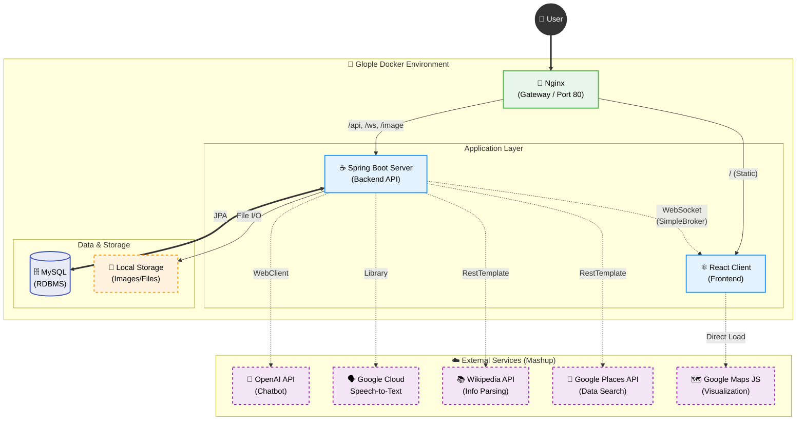

# 🌍 Glople
> **"나만의 여행, 현지 전문가와 함께 완성하다."**  
> MBTI & 키워드 기반 여행지 추천 및 예약 대행자(Glopler) 매칭 플랫폼

---

## 📖 프로젝트 소개 (Project Overview)
**Glople**은 여행자가 자신의 성향(MBTI, 키워드)에 맞는 여행지를 추천받고, 해당 지역의 전문가인 **'글로플러**와 매칭되어 개인화된 여행 경험을 제공받는 **매시업(Mashup) 기반 여행 플랫폼**입니다.

**Spring Boot**와 **React**를 기반으로 구축되었으며, **Nginx**를 리버스 프록시로 두어 단일 진입점에서 효율적인 라우팅을 처리합니다. 특히 **OpenAI, Google Cloud, Wikipedia** 등 다양한 외부 API를 백엔드에서 직접 연동하여 풍부한 여행 정보를 제공합니다.

 

## 🛠 기술 스택 (Tech Stack)

### 🎨 Frontend
| Tech | Description |
| :--- | :--- |
| **Framework** | React.js (Create-React-App) |
| **State Mgt** | Context API / Local State |
| **Styling** | Styled-components, Ant Design |
| **Libraries** | React-Quill (Web Editor), React-Beautiful-Dnd (Drag & Drop) |
| **Map Integration** | **Google Maps JavaScript API** (Maps, Places Library) |

### ☕ Backend
| Tech | Description |
| :--- | :--- |
| **Framework** | Spring Boot, Spring Security |
| **Language** | **Java 17** |
| **Database** | MySQL 8.0 (JPA/Hibernate) |
| **Communication** | **WebSocket (SimpleBroker)**, REST API |
| **Algorithm** | **Cosine Similarity** (User Recommendation Algorithm) |
| **Http Client** | **WebClient**, **RestTemplate** (for External APIs) |

### ☁️ Infra & DevOps
| Tech | Description |
| :--- | :--- |
| **Gateway** | **Nginx** (Reverse Proxy) |
| **Container** | **Docker**, **Docker Compose** |
| **File System** | **Local Volume** (Static Resources Storage) |

### 🌐 External APIs (Mashup)
| Service | Usage |
| :--- | :--- |
| **OpenAI API** | GPT-3.5 Turbo 기반 실시간 AI 챗봇 상담 |
| **Google Cloud API** | Speech-to-Text (음성 메시지 변환) |
| **Google Places API** | (Backend) 장소 텍스트 검색 및 상세 정보 조회 |
| **Wikipedia API** | 여행지 요약 정보 실시간 파싱 및 제공 |

 

## 🏗 시스템 아키텍처 (System Architecture)

 

## 🌟 핵심 기능 (Key Features)

### 1. 🗺️ MBTI & 키워드 기반 추천 알고리즘
- **자체 구현:** 사용자 데이터(나이, 성별, MBTI)를 벡터화하여 **코사인 유사도(Cosine Similarity)**를 계산, 성향이 유사한 사용자의 여행 루트를 추천하는 로직을 Java로 직접 구현했습니다.

### 2. 🤖 멀티모달(Multi-modal) 채팅 시스템
- **실시간 통신:** **WebSocket(STOMP)**과 Spring 내장 브로커를 사용하여 여행자와 글로플러 간 지연 없는 채팅을 지원합니다.
- **AI & 음성:** **OpenAI API**를 연동한 챗봇 상담과, **Google Cloud STT**를 활용한 음성-텍스트 변환 기능을 제공합니다.

### 3. 📍 Google Maps & Wikipedia 매시업
- **데이터 통합:** 프론트엔드의 지도 시각화뿐만 아니라, 백엔드(`PlaceController`)에서도 **Google Places API**를 호출하여 장소 데이터를 수집하고, **Wikipedia API**를 통해 역사/문화 정보를 통합 제공합니다.

### 4. 🤝 예약 및 포인트 시스템
- **프로세스 관리:** [매칭 -> 진행 -> 입금 -> 완료]의 예약 단계를 상태값(`progress`)으로 관리합니다.
- **트랜잭션:** 포인트 차감 및 적립 로직(`PointsHistory`)을 트랜잭션으로 묶어 데이터 무결성을 보장합니다.

 
