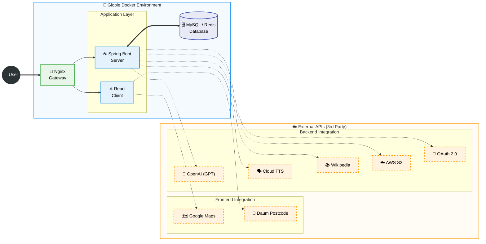

# 🌍 Glople
> **"나만의 여행, 현지 전문가와 함께 완성하다."**  
> MBTI & 키워드 기반 여행지 추천 및 현지 전문가(Glopler) 매칭 플랫폼 & 커뮤니티

---

## 📖 프로젝트 소개 (Project Overview)
**Glople**은 여행자가 자신의 성향(MBTI, 키워드)에 맞는 여행지를 추천받고, 해당 지역의 전문가인 **'글로플러(Glopler)'**와 매칭되어 개인화된 여행 경험을 제공받는 **매시업(Mashup) 기반 여행 플랫폼**입니다.

단순한 정보 검색을 넘어, **Google Maps API**와 **Wikipedia API**를 결합하여 시각적이고 풍부한 정보를 제공하며, **OpenAI(ChatGPT)**와 **Google Cloud TTS**를 활용한 스마트한 여행 상담 시스템을 구축했습니다. 또한 **Docker Compose**와 **Nginx**를 활용한 컨테이너 기반 아키텍처로 안정적인 서비스를 제공합니다.

 

## 🛠 기술 스택 (Tech Stack)

### 🎨 Frontend
| Tech | Description |
| :--- | :--- |
| **Framework** | React.js (Create-React-App) |
| **State Mgt** | Context API / Local State |
| **Styling** | Styled-components, Ant Design |
| **Libraries** | React-Quill (Web Editor), React-Beautiful-Dnd (Drag & Drop) |

### ☕ Backend
| Tech | Description |
| :--- | :--- |
| **Framework** | Spring Boot 3.x, Spring Security |
| **Language** | **Java 17** |
| **Database** | MySQL 8.0 (JPA/Hibernate), **Redis** (Cache/Session) |
| **Communication** | **WebSocket (StompJS)**, REST API |
| **Algorithm** | **Cosine Similarity** (User Recommendation) |

### ☁️ Infra & DevOps
| Tech | Description |
| :--- | :--- |
| **Gateway** | **Nginx** (Reverse Proxy & Load Balancing) |
| **Container** | **Docker**, **Docker Compose** |
| **Storage** | AWS S3 (Image Storage) |

### 🌐 External APIs (Mashup)
| Service | Usage |
| :--- | :--- |
| **OpenAI API** | GPT-3.5 Turbo 기반 실시간 AI 챗봇 상담 |
| **Google Cloud TTS** | 텍스트 정보를 음성으로 변환하여 제공 (Accessibility) |
| **Google Maps Platform** | Maps, Places, Geocoding API를 활용한 루트 시각화 |
| **Wikipedia API** | 여행지 역사 및 상세 정보 실시간 파싱 및 제공 |
| **OAuth 2.0** | Naver, Kakao, Google 소셜 로그인 연동 |

 

## 🏗 시스템 아키텍처 (System Architecture)

 

## 🌟 핵심 기능 (Key Features)
### 1. 🗺️ MBTI & 키워드 기반 코사인 유사도 추천
- **알고리즘 구현:** 사용자 데이터(나이, 성별, MBTI)를 다차원 벡터로 변환하고, **코사인 유사도(Cosine Similarity)** 공식을 Java로 직접 구현하여 성향이 가장 비슷한 사용자의 여행 루트를 추천합니다.
- **키워드 매칭:** 여행지 관련 키워드를 분석하여 사용자 취향에 딱 맞는 장소를 제안합니다.

### 2. 🤖 멀티모달(Multi-modal) 채팅 시스템
- **실시간 통신:** **WebSocket(STOMP)** 프로토콜을 사용하여 여행자와 글로플러 간 지연 없는 1:1 채팅을 지원합니다.
- **음성 인식(STT):** 사용자가 전송한 음성 파일(.wav)을 **Google Cloud Speech API**로 전송하여 텍스트로 변환하는 기능을 제공합니다.
- **AI 챗봇:** **OpenAI API**를 연동하여 24시간 여행 관련 질문에 응답하는 챗봇 '글로'를 구현했습니다.

### 3. 📍 Google Maps & Wikipedia 매시업
- **루트 설계:** **Google Places API**로 장소를 검색하고, Drag & Drop으로 경유지 순서를 변경하면 **Maps API**가 최적의 동선을 지도에 그려줍니다.
- **정보 연동:** 특정 장소를 클릭하면 **Wikipedia API**를 호출하여 해당 장소의 역사적 배경과 설명을 자동으로 불러옵니다.

### 4. 🤝 예약 및 포인트 시스템
- **프로세스 시각화:** [매칭 요청 -> 대행 진행 -> 입금 확인 -> 여행 완료]의 4단계 예약 진행 상황을 직관적인 UI로 제공합니다.
- **포인트 거래:** 유저와 글로플러 간의 안전한 거래를 위해 내부 포인트 차감/적립 로직을 트랜잭션 단위로 처리합니다.

 
